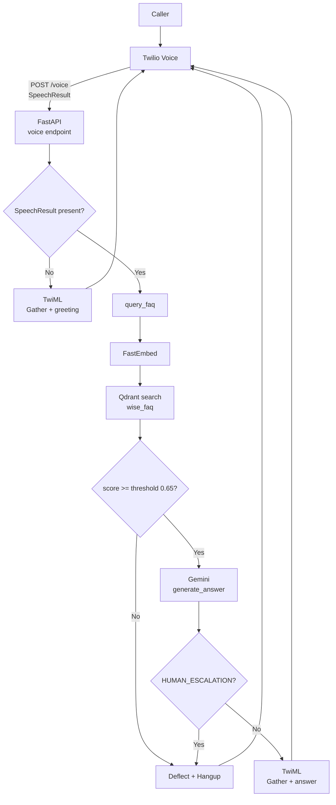
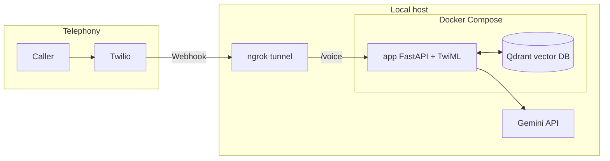

# Simple Voice Agent Architecture

## 1) High-Level Flow

## 2) Runtime and Deployment Topology

## 3) Tech Stack and Responsibilities

- FastAPI (`app/main.py`): exposes `/voice` webhook, parses Twilio `SpeechResult`, and returns TwiML responses.
- Twilio Voice (`<Gather>`, `<Say>`, `<Hangup>`): handles call leg, speech capture, and synthesized voice output.
- FastEmbed (`app/rag.py`): converts caller question into an embedding vector.
- Qdrant (`app/rag.py`, `scripts/ingest_faq.py`): stores FAQ vectors and returns nearest match by cosine similarity.
- Gemini (`app/llm.py`): converts retrieved FAQ context into short phone-friendly responses and can trigger escalation (`HUMAN_ESCALATION`).
- Docker Compose (`docker-compose.yml`): runs app + Qdrant locally with stable network/service naming.
- ngrok (host runtime): provides a public HTTPS webhook URL for Twilio to reach local app.

## 4) Core Technical Details

- Retrieval gate:
  - `SIMILARITY_THRESHOLD = 0.65` in `app/rag.py`
  - If best match score is below threshold, call is deflected to human flow.
- LLM guardrail:
  - System prompt requires context-only answers and explicit `HUMAN_ESCALATION` for unrelated questions.
- STT configuration (env-driven):
  - `TWILIO_GATHER_SPEECH_MODEL`, `TWILIO_GATHER_LANGUAGE`, `TWILIO_GATHER_TIMEOUT`, `TWILIO_GATHER_SPEECH_TIMEOUT`, `TWILIO_GATHER_HINTS`
  - Current default speech model in code: `googlev2_telephony`
- TTS configuration (env-driven):
  - `TWILIO_TTS_VOICE`, `TWILIO_TTS_LANGUAGE`
  - Current default voice in code: `Polly.Joanna-Neural`
- Qdrant connectivity:
  - `QDRANT_HOST`, `QDRANT_PORT`
  - Docker Compose uses service-to-service host `qdrant`; local default is `localhost`.

## 5) Expected Behavioral Contract

- In-scope FAQ-like questions ("Where is my money" topic family): answer from retrieved Wise FAQ context.
- Out-of-scope questions: respond with human-agent deflection message and terminate the call.
